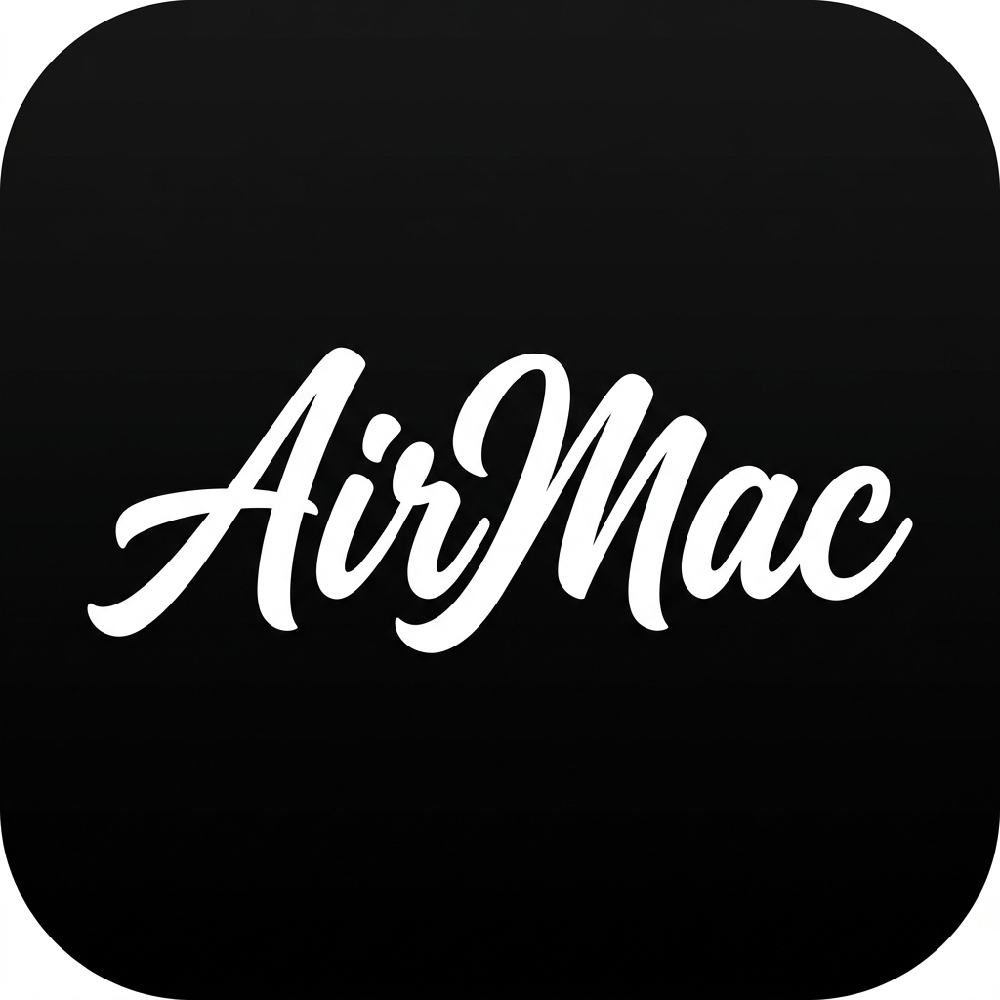

# AirMac 📱💻

<p align="center">
  
</p>

[English](#english) | [中文说明](#中文说明)

AirMac turns an iPhone into a low-latency trackpad and keyboard for a Mac on the same trusted local network. It uses a FastAPI/WebSocket server and macOS Quartz input events.

> Security boundary: AirMac uses device pairing and bearer-token authentication, but the default zero-configuration setup is HTTP/WS, not encrypted HTTPS/WSS. Use it only on a trusted home or personal LAN. Do not expose port 8000 to the internet or use it on an untrusted/shared network.

## English

### Features

- One-finger cursor movement and tap-to-click
- Two-finger right-click and scrolling
- Three-finger Mission Control and desktop switching
- Long-press dragging with disconnect-safe mouse release
- Keyboard input and long-text projection
- Automatic copy feedback with a native macOS HUD
- Media, fullscreen, display sleep, and wake controls
- Six-digit, short-lived pairing codes and revocable device tokens

### Install

```bash
cd iphone_mac_remote
python3 -m venv venv
source venv/bin/activate
pip install -r requirements.txt
```

Grant Accessibility permission to the terminal/Python process in **System Settings → Privacy & Security → Accessibility**.

For a foreground run:

```bash
uvicorn main:app --host 0.0.0.0 --port 8000 --ws-max-size 65536 --log-config logging_config.json
```

For a login service that also builds the Swift HUD when the local toolchain supports it:

```bash
./install_service.sh
```

Open the URL printed by AirMac in iPhone Safari. On first use, name the phone, request a pairing code, and enter the six digits shown in the Mac dialog. The resulting device token is stored by Safari and is never placed in the WebSocket URL or access log.

Add the page to the iPhone Home Screen for the full-screen experience.

### Paired-device management

Run these commands locally on the Mac:

```bash
python manage_devices.py list
python manage_devices.py revoke DEVICE_ID
python manage_devices.py clear --yes
```

Revoked active devices are disconnected within approximately one second. Device records are stored with user-only permissions at:

```text
~/Library/Application Support/AirMac/authorized_devices.json
```

Logs from the LaunchAgent are stored at:

```text
~/Library/Logs/AirMac/remote.log
```

Every log line includes local time with millisecond precision. Slow pointer events report queue and Quartz execution time separately, making network interruptions distinguishable from macOS input stalls.

The legacy `whitelist.json` format is intentionally not migrated because its client-generated IDs were not secure credentials. Existing devices must pair again after upgrading.

If the installed Swift compiler and macOS SDK do not match, installation continues and copy feedback falls back to a standard macOS notification.

### Development checks

```bash
pip install -r requirements-dev.txt
pytest
bash -n install_service.sh uninstall_service.sh
```

## 中文说明

AirMac 可以把同一可信局域网中的 iPhone 变成 Mac 的低延迟触控板和键盘。后端使用 FastAPI、WebSocket 与 macOS Quartz 原生输入事件。

> 安全边界：AirMac 具有一次性验证码配对和设备令牌认证，但默认零配置模式使用未加密的 HTTP/WS。请只在可信家庭或个人局域网中使用，不要把 8000 端口暴露到互联网，也不要在不可信共享网络中使用。

### 功能

- 单指移动、轻点左键
- 双指右键和滚动
- 三指调度中心及桌面切换
- 长按拖拽，断线时自动释放鼠标
- 手机键盘输入和长文本投射
- 自动复制与 macOS 原生 HUD 提示
- 媒体、全屏、息屏与唤醒控制
- 6 位短时验证码配对、可撤销设备令牌

### 安装与运行

```bash
cd iphone_mac_remote
python3 -m venv venv
source venv/bin/activate
pip install -r requirements.txt
```

进入 **系统设置 → 隐私与安全性 → 辅助功能**，为终端或实际运行 AirMac 的 Python 进程授权。

前台运行：

```bash
uvicorn main:app --host 0.0.0.0 --port 8000 --ws-max-size 65536 --log-config logging_config.json
```

安装为登录后自动运行的 LaunchAgent，并在本机工具链可用时自动编译 Swift HUD：

```bash
./install_service.sh
```

在 iPhone Safari 中打开终端打印的网址。首次使用时输入设备名称，请求配对，然后把 Mac 弹窗显示的 6 位验证码填到手机。配对令牌保存在 Safari 中，不会出现在 WebSocket URL 或访问日志里。

推荐通过 Safari 分享菜单选择“添加到主屏幕”。

如果 Swift 编译器与 macOS SDK 不匹配，安装仍会继续，复制反馈会自动退回 macOS 系统通知。

### 管理设备

以下命令只能在 Mac 本机执行：

```bash
python manage_devices.py list
python manage_devices.py revoke 设备ID
python manage_devices.py clear --yes
```

撤销后，正在连接的设备会在约一秒内断开。旧版 `whitelist.json` 不会迁移或自动删除；升级后需要重新配对一次。

后台日志位于 `~/Library/Logs/AirMac/remote.log`。每行包含精确到毫秒的本地时间；若指针处理变慢，日志会分别记录排队时间和 Quartz 执行时间，方便区分网络中断与 Mac 输入层阻塞。

卸载后台服务不会删除设备记录或日志：

```bash
./uninstall_service.sh
```
