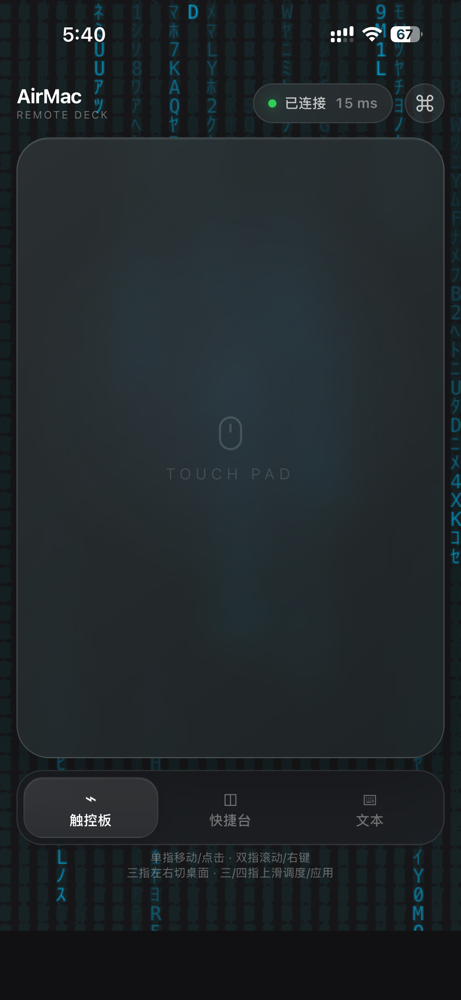
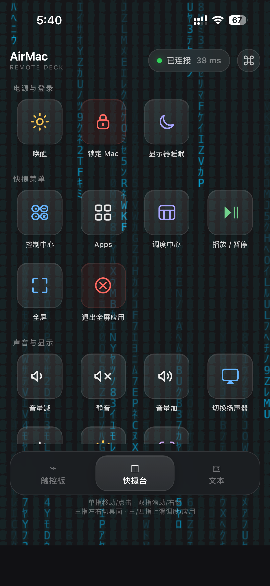
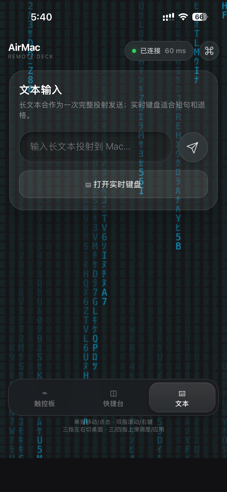
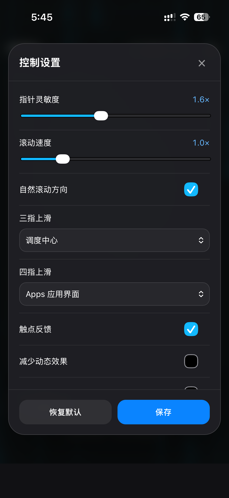
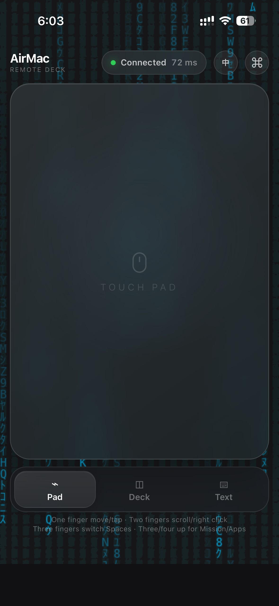
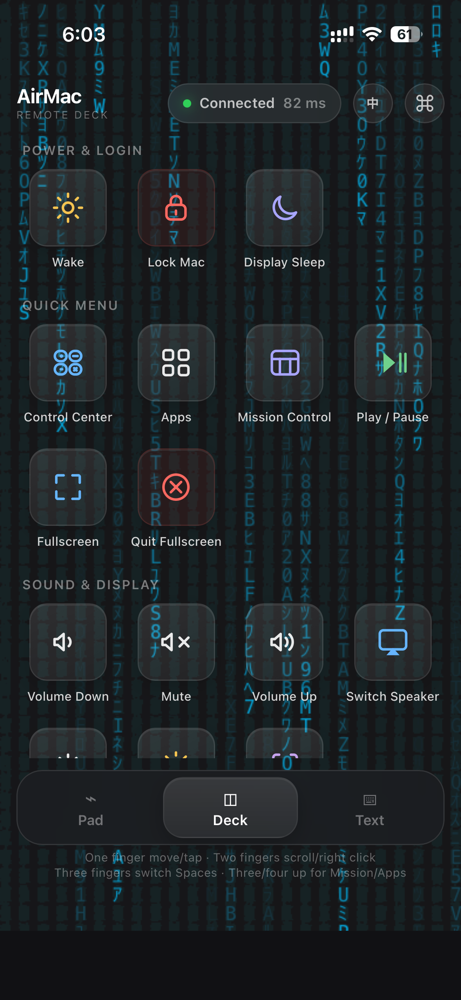
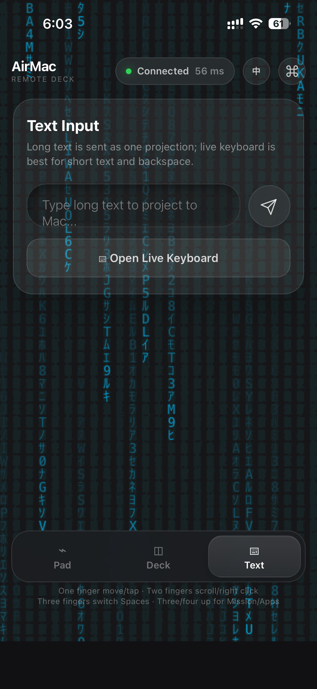
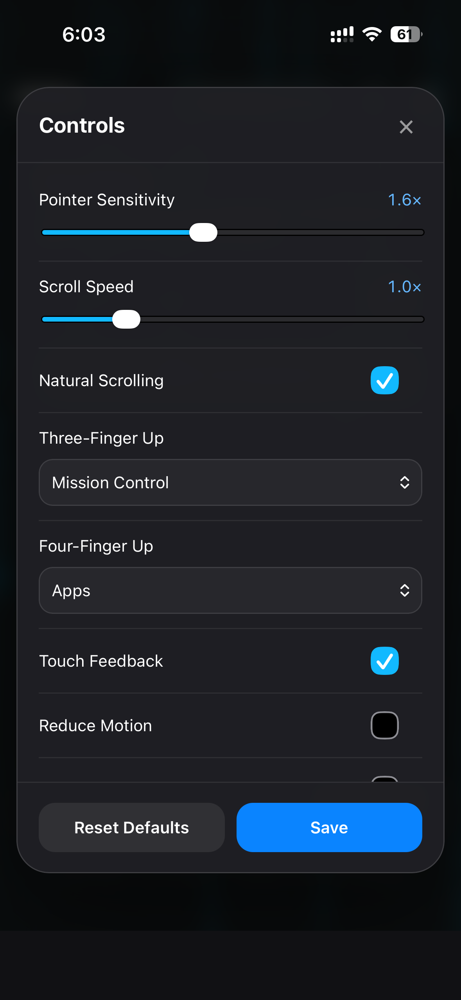

# AirMac 📱💻

<p align="center">
  
</p>

[English](#english) | [中文说明](#中文说明) | [Screenshots](#screenshots--截图)

AirMac turns an iPhone into a low-latency trackpad and keyboard for a Mac on the same trusted local network. It uses a FastAPI/WebSocket server and macOS Quartz input events.

> Security boundary: AirMac uses device pairing and bearer-token authentication, but the default zero-configuration setup is HTTP/WS, not encrypted HTTPS/WSS. Use it only on a trusted home or personal LAN. Do not expose port 8000 to the internet or use it on an untrusted/shared network.

AirMac never stores or transmits the Mac login password and does not attempt to
turn iPhone Touch ID or Face ID into a macOS login credential. Apple exposes Mac
Auto Unlock through Apple Watch, not through an iPhone web app.

## Project status

The repository is maintained as an MIT-licensed open-source project. Local logs,
pairing databases, legacy whitelists, virtual environments, and generated helper
binaries are kept out of Git.

Recommended pre-publish check:

```bash
git status --short
git ls-files
python -m pip install -r requirements-dev.txt
pytest -q
node --test tests/*.test.js
bash -n install_service.sh uninstall_service.sh tools/generate_pwa_icons.sh
```

## Screenshots / 截图

Chinese interface:

<p>
  
  
  
  
</p>

English interface:

<p>
  
  
  
  
</p>

## English

### Features

- One-finger cursor movement and tap-to-click
- Two-finger right-click and scrolling
- Three-finger Mission Control and desktop switching
- Four-finger upward swipe to open Launchpad or the macOS Apps interface
- AirMac Deck tabs for trackpad, fixed quick actions, and text input
- Compact Chinese/English language switcher with the preference saved on device
- Live connection/latency indicator and persisted sensitivity, scroll, gesture,
  motion, and power preferences
- Window tiling, volume, brightness, screenshot-to-clipboard, lock, sleep, and
  wake shortcuts
- One-tap Control Center access, plus cycling through available audio output devices
- Close the focused window only when macOS reports that it is full screen
- Long-press dragging with disconnect-safe mouse release
- Keyboard input and long-text projection
- Confirmed long-text delivery with a compact in-field clear button
- Automatic copy feedback with a native macOS HUD
- Media, fullscreen, display sleep, and wake controls
- Six-digit, short-lived pairing codes and revocable device tokens
- Native macOS menu-bar status and paired-device management
- Installable Home Screen web app with manifest and adaptive icons

### Gesture reference

| Gesture | Result |
| --- | --- |
| One-finger move / tap | Move pointer / left click |
| Two-finger move / tap | Scroll / right click |
| Double tap | Triple-click selection followed by automatic copy |
| Press and hold, then move | Drag; disconnecting always releases the mouse |
| Three-finger swipe up | Mission Control by default; configurable to Apps |
| Three-finger swipe left or right | Switch Spaces |
| Four-finger swipe up | Apps by default; configurable to Mission Control/off |

### Install

```bash
git clone https://github.com/yilinxiong/AirMac.git
cd AirMac
python3 -m venv venv
source venv/bin/activate
pip install -r requirements.txt
```

Grant Accessibility permission to the terminal/Python process in **System Settings → Privacy & Security → Accessibility**.

For a foreground run:

```bash
uvicorn main:app --host 0.0.0.0 --port 8000 --ws-max-size 65536 --log-config logging_config.json
```

For login services that build and start both the native menu-bar manager and,
when the local Swift toolchain supports it, the copy HUD:

```bash
./install_service.sh
```

Open the URL printed by AirMac in iPhone Safari. On first use, name the phone, request a pairing code, and enter the six digits shown in the Mac dialog. The resulting device token is stored by Safari and is never placed in the WebSocket URL or access log.

The mobile interface has three bottom tabs. **Pad** keeps the largest possible
touch surface, **Deck** contains fixed macOS shortcuts, and **Text** contains both
confirmed long-text projection and the live keyboard. The top status pill reports
connection state and smoothed heartbeat latency. Use the small language button in
the top-right corner to switch between Chinese and English; the preference stays
on the phone. Open the command button next to it to tune pointer/scroll speed,
scroll direction, gesture mapping, touch feedback, reduced motion, and low-power
mode.
The Deck **Quick Menu** group contains one-tap Control Center, Apps, Mission
Control, playback, fullscreen, and quit-fullscreen-app actions. Quit Fullscreen App
uses macOS Accessibility state plus an exact display-bounds fallback and does
nothing when the focused window is not full screen. It sends the standard
Command-Q graceful quit, so an app can still show its normal unsaved-work prompt.
**Switch Speaker** cycles through
currently available Core Audio output devices and reports the selected device
name on the phone. Wake, lock, and display sleep stay at the top of Deck;
less-used window controls stay at the bottom.

Add the page to the iPhone Home Screen for the full-screen experience. AirMac now
includes a complete web app manifest, iPhone and maskable icons, and an in-app
installation hint. A cached offline explanation page is available when the browser
allows Service Workers. Browsers normally require HTTPS for Service Workers, so
plain LAN HTTP may skip that optional cache without affecting remote control.

The AirMac cursor icon in the macOS menu bar shows whether the background service
is reachable. Its menu can open or copy the phone URL, show and revoke paired
devices, reveal logs, and restart the service. Choosing **Quit Menu Bar Icon** hides
only the icon; the remote-control server continues running and the icon returns at
the next login or service installation.

Locking the iPhone or sending the page to the background intentionally pauses the
WebSocket. Returning to AirMac reconnects automatically. The server expires an
unresponsive foreground session after 16 seconds so a stale mobile connection
cannot hold the controller indefinitely.

After an authenticated phone connection, AirMac checks the main display and wakes
it only when macOS reports that it is asleep. The same cancellable 30-second
display assertion used by the Wake button prevents an immediate return to sleep.
This cannot bypass the password or lock screen. While AirMac is installed and the
Mac is on AC power, it also holds an AC-only system-sleep assertion so the display
may turn off and lock while the HTTP service remains reachable. The assertion is
automatically ineffective on battery and ends with the AirMac process. Set
`AIRMAC_KEEP_REACHABLE_ON_AC=0` during installation to restore normal AC deep
sleep. A closed laptop lid, explicit deep sleep, or a battery-powered sleeping Mac
still requires an external Wake-on-LAN capable device; an iPhone web page cannot
send that UDP packet itself.

### Paired-device management

Run these commands locally on the Mac:

```bash
python manage_devices.py list
python manage_devices.py revoke DEVICE_ID
python manage_devices.py clear --yes
python manage_devices.py status
python manage_devices.py diagnose
```

Revoked active devices are disconnected within approximately one second. Device records are stored with user-only permissions at:

```text
~/Library/Application Support/AirMac/authorized_devices.json
```

Logs from the LaunchAgent are stored at:

```text
~/Library/Logs/AirMac/remote.log
```

Every log line includes local time with millisecond precision. Slow pointer events report queue and Quartz execution time separately, making network interruptions distinguishable from macOS input stalls. LaunchAgent logs rotate at 5 MiB with four backups, limiting the main log set to approximately 25 MiB.

The legacy `whitelist.json` format is intentionally not migrated because its client-generated IDs were not secure credentials. Existing devices must pair again after upgrading.

### Architecture, protocol, and diagnostics

AirMac's WebSocket is an adapter around a transport-neutral connection handler.
Authentication, the single-controller lease, reconnect replacement, revocation,
idle expiry, notification serialization, and text-projection idempotency therefore
remain independent of FastAPI and can be reused by a future native or BLE
transport. The macOS controller keeps two bounded ordered lanes—pointer and
control—and delegates native work to injectable pointer, clipboard, wake, and
system services.

The current web client requests protocol v2. The server still treats an
authentication frame without `protocol_version` as v1, so already cached clients
keep working. A v2 `auth_ok` advertises the negotiated version, server version,
session ID, capabilities, heartbeat interval, and protocol limits. Unsupported
versions are rejected before the controller is claimed.

`python manage_devices.py diagnose` reads the loopback-only
`/api/diagnostics` endpoint. It reports the AirMac/protocol version, uptime,
controller state, bounded queue counters, maximum observed event-loop delay, AC
reachability-assertion state, and the latest disconnect category. It never returns
a device ID, client IP, token, or projected text.

Runtime settings are validated at startup. The defaults remain port `8000`, a
5-second authentication timeout, a 16-second foreground-session lease, a 1-second
monitor interval, and `INFO` logging. Supported environment variables are:

```text
AIRMAC_PORT
AIRMAC_AUTH_TIMEOUT_SECONDS
AIRMAC_SESSION_IDLE_SECONDS
AIRMAC_MONITOR_INTERVAL_SECONDS
AIRMAC_METRICS_LOG_INTERVAL_SECONDS
AIRMAC_EVENT_LOOP_LAG_WARNING_SECONDS
AIRMAC_LOG_LEVEL
AIRMAC_DEBUG=0|1
AIRMAC_KEEP_REACHABLE_ON_AC=0|1
```

For a non-default installed port, run `AIRMAC_PORT=8123 ./install_service.sh`.
The generated server LaunchAgent, menu-bar helper, health check, and management
CLI then use the same port. Invalid ports fail installation instead of producing
a partly working service. The installer records this non-secret local setting in
`~/Library/Application Support/AirMac/runtime.json`.

If the installed Swift compiler and macOS SDK do not match, installation continues and copy feedback falls back to a standard macOS notification.

### Troubleshooting

```bash
python manage_devices.py status
python manage_devices.py diagnose
tail -f "$HOME/Library/Logs/AirMac/remote.log"
launchctl print "gui/$(id -u)/com.airmac.remote"
```

Frontend scripts use versioned URLs and a network-first Service Worker strategy,
so an installed web app cannot combine a new interface with stale state modules.
If a Home Screen app is already open during an upgrade, close and reopen it once
to start the newly installed page.

### Development checks

```bash
pip install -r requirements-dev.txt
pytest
node --test tests/*.test.js
bash -n install_service.sh uninstall_service.sh tools/generate_pwa_icons.sh
clang -fobjc-arc -framework Cocoa menubar.m -o /tmp/airmac-menubar-check
clang -fobjc-arc -framework Foundation -framework CoreAudio audio_switcher.m -o /tmp/airmac-audio-switcher-check
```

## 中文说明

AirMac 可以把同一可信局域网中的 iPhone 变成 Mac 的低延迟触控板和键盘。后端使用 FastAPI、WebSocket 与 macOS Quartz 原生输入事件。

> 安全边界：AirMac 具有一次性验证码配对和设备令牌认证，但默认零配置模式使用未加密的 HTTP/WS。请只在可信家庭或个人局域网中使用，不要把 8000 端口暴露到互联网，也不要在不可信共享网络中使用。

AirMac 不保存或传输 Mac 登录密码，也不会把 iPhone 的触控 ID/面容 ID 伪装成 macOS
登录凭据。Apple 官方提供的是 Apple Watch 自动解锁，而不是 iPhone 网页远程解锁。

### 功能

- 单指移动、轻点左键
- 双指右键和滚动
- 三指调度中心及桌面切换
- 四指上滑打开 Launchpad 或新版 macOS Apps 应用界面
- AirMac Deck 三页布局：触控板、快捷台与文本输入
- 紧凑的中英切换按钮，语言偏好保存在手机本地
- 实时连接/延迟状态，以及可保存的灵敏度、滚动、手势、动态效果和功耗设置
- 窗口平铺、音量、亮度、截屏到剪贴板、锁定、息屏与唤醒快捷动作
- 一键打开控制中心，以及循环切换可用音频输出设备
- 仅当前台聚焦窗口确实处于全屏时关闭该窗口
- 长按拖拽，断线时自动释放鼠标
- 手机键盘输入和长文本投射
- 长文本执行确认，以及输入框内嵌的一键清空按钮
- 自动复制与 macOS 原生 HUD 提示
- 媒体、全屏、息屏与唤醒控制
- 6 位短时验证码配对、可撤销设备令牌
- 原生 macOS 菜单栏状态与配对设备管理
- 带 manifest 和自适应图标的主屏幕 Web App

### 手势对照

| 手势 | 功能 |
| --- | --- |
| 单指移动 / 轻点 | 移动光标 / 左键点击 |
| 双指移动 / 轻点 | 滚动 / 右键点击 |
| 连续轻点两次 | 三击选中文本并自动复制 |
| 单指长按后移动 | 拖拽；断线时强制释放鼠标 |
| 三指上滑 | 默认打开调度中心，可改为 Apps |
| 三指左右滑 | 切换桌面空间 |
| 四指上滑 | 默认打开 Apps，可改为调度中心或关闭 |

### 安装与运行

```bash
git clone https://github.com/yilinxiong/AirMac.git
cd AirMac
python3 -m venv venv
source venv/bin/activate
pip install -r requirements.txt
```

进入 **系统设置 → 隐私与安全性 → 辅助功能**，为终端或实际运行 AirMac 的 Python 进程授权。

前台运行：

```bash
uvicorn main:app --host 0.0.0.0 --port 8000 --ws-max-size 65536 --log-config logging_config.json
```

安装为登录后自动运行的 LaunchAgent；安装脚本会构建并启动原生菜单栏管理器，
并在本机 Swift 工具链可用时自动编译复制 HUD：

```bash
./install_service.sh
```

在 iPhone Safari 中打开终端打印的网址。首次使用时输入设备名称，请求配对，然后把 Mac 弹窗显示的 6 位验证码填到手机。配对令牌保存在 Safari 中，不会出现在 WebSocket URL 或访问日志里。

手机界面底部包含三个页面：“触控板”保留最大触摸区域，“快捷台”放置固定且经过协议
校验的 macOS 动作，“文本”集中长文本投射与实时键盘。顶部状态胶囊显示连接状态和经过
平滑处理的心跳延迟；右上角的小语言按钮可以在中文和英文之间切换，偏好保存在手机本地。
旁边的命令按钮可以调整指针/滚动速度、滚动方向、三/四指映射、触点反馈、减少动态效果
和低功耗模式。
快捷台的“快捷菜单”分组包含一键控制中心、Apps、调度中心、播放、全屏和退出全屏应用；
控制中心按钮使用 macOS 全局 `Fn-C` 快捷键，因此当前应用处于全屏 Space 时仍可使用。
“退出全屏应用”通过 macOS 辅助功能状态和严格的显示器边界后备检测检查聚焦窗口；
普通窗口会被忽略。确认全屏后发送标准 `Command-Q` 正常退出，应用仍可显示未保存内容
确认框，不会执行强制终止。
“切换扬声器”会在当前可用的 Core Audio 输出设备间循环，并在手机上显示设备名称。
唤醒、锁定和显示器睡眠位于快捷台顶部，较少使用的窗口操作位于最底部。三页共用的
紧凑手势提示常驻底部导航栏下方。

推荐通过 Safari 分享菜单选择“添加到主屏幕”。AirMac 已包含完整 manifest、
iPhone/自适应图标和应用内安装提示。浏览器允许 Service Worker 时，还会缓存一个
断网说明页面；局域网 HTTP 通常不满足 Service Worker 的 HTTPS 要求，因此可能跳过
这项可选缓存，但不会影响远程控制功能。

Mac 菜单栏中的 AirMac 光标图标会显示后台服务是否可用。菜单内可以打开或复制
手机访问地址、查看和撤销配对设备、打开日志以及重启服务。“退出菜单栏图标”只会
隐藏图标，不会停止远程控制服务；下次登录或重新安装服务时图标会再次出现。

iPhone 锁屏或页面进入后台时会主动暂停 WebSocket；回到 AirMac 后自动恢复。
服务端会在前台连接连续 16 秒没有心跳时清理僵尸会话，避免旧连接长期占用控制器。

手机认证连接后，AirMac 会检查主显示器，只在 macOS 报告显示器处于休眠状态时自动
唤醒；已经亮屏时不会刷新闲置计时。自动唤醒和手动唤醒共用 30 秒、可取消的显示器
保活断言，避免刚唤醒又立刻息屏，但不会绕过 macOS 的锁屏或密码策略。安装服务运行且
Mac 接通电源时，AirMac 还会持有仅在交流电源下有效的系统睡眠断言：显示器仍可熄灭和
锁屏，但 HTTP 服务不会因深度空闲失联。拔掉电源或 AirMac 退出后断言自动失效；安装时
设置 `AIRMAC_KEEP_REACHABLE_ON_AC=0` 可恢复插电深度睡眠。合盖、主动深度睡眠或电池
供电下睡眠后仍需要其他能发送 Wake-on-LAN 的设备，手机网页无法自行发送该 UDP 包。

如果 Swift 编译器与 macOS SDK 不匹配，安装仍会继续，复制反馈会自动退回 macOS 系统通知。

### 开源项目状态

当前仓库以 MIT License 开源维护。本地日志、配对数据库、旧白名单、虚拟环境
和生成的辅助二进制都不会被 Git 跟踪。

### 管理设备

以下命令只能在 Mac 本机执行：

```bash
python manage_devices.py list
python manage_devices.py revoke 设备ID
python manage_devices.py clear --yes
python manage_devices.py status
python manage_devices.py diagnose
```

撤销后，正在连接的设备会在约一秒内断开。旧版 `whitelist.json` 不会迁移或自动删除；升级后需要重新配对一次。

后台日志位于 `~/Library/Logs/AirMac/remote.log`。每行包含精确到毫秒的本地时间；若指针处理变慢，日志会分别记录排队时间和 Quartz 执行时间，方便区分网络中断与 Mac 输入层阻塞。日志每 5 MiB 轮转，保留 4 份备份，主日志集合约占 25 MiB。

### 架构、协议与诊断

WebSocket 现在只是传输适配层。认证、单控制器租约、同设备重连替换、撤销、空闲过期、
通知串行化和文本投射幂等均由独立连接处理器负责，不依赖 FastAPI `WebSocket`，便于未来
复用于原生客户端或 BLE fallback。macOS 控制器继续保留指针与控制两个有界顺序通道，
并把指针、剪贴板、唤醒和系统动作拆为可注入服务。

新网页客户端使用协议 v2；认证帧未携带 `protocol_version` 时仍按 v1 处理，因此旧缓存
客户端可以继续连接。v2 的 `auth_ok` 会返回协商版本、服务端版本、会话 ID、能力、心跳
间隔和协议限制。不支持的版本会在获得控制权和执行任何动作之前被拒绝。

`python manage_devices.py diagnose` 会访问仅限 loopback 的 `/api/diagnostics`，输出版本、
运行时间、控制状态、队列计数、事件循环最大延迟、插电可达性断言和最近断线类别。该接口
不会返回设备 ID、客户端 IP、令牌或文本内容。

运行参数会在启动时校验。默认端口、认证超时、前台会话超时、监控周期和日志等级仍为
`8000`、5 秒、16 秒、1 秒和 `INFO`。可用环境变量如下：

```text
AIRMAC_PORT
AIRMAC_AUTH_TIMEOUT_SECONDS
AIRMAC_SESSION_IDLE_SECONDS
AIRMAC_MONITOR_INTERVAL_SECONDS
AIRMAC_METRICS_LOG_INTERVAL_SECONDS
AIRMAC_EVENT_LOOP_LAG_WARNING_SECONDS
AIRMAC_LOG_LEVEL
AIRMAC_DEBUG=0|1
AIRMAC_KEEP_REACHABLE_ON_AC=0|1
```

如需把安装端口改为 8123，执行 `AIRMAC_PORT=8123 ./install_service.sh`。安装脚本生成的
服务、菜单栏工具、健康检查和管理 CLI 会使用同一端口；非法端口会直接拒绝安装。
这项非敏感本机配置保存在 `~/Library/Application Support/AirMac/runtime.json`。

常用排查命令：

```bash
python manage_devices.py status
python manage_devices.py diagnose
tail -f "$HOME/Library/Logs/AirMac/remote.log"
launchctl print "gui/$(id -u)/com.airmac.remote"
```

前端脚本使用版本化 URL，Service Worker 对脚本采用网络优先策略，避免新界面与旧状态
模块混用。如果升级时主屏幕版本正在运行，关闭后重新打开一次即可载入新页面。

卸载后台服务不会删除设备记录或日志：

```bash
./uninstall_service.sh
```

## Development map / 开发索引

| File | Responsibility |
| --- | --- |
| `main.py` | FastAPI routes, dependency composition, lifecycle, security headers and asset whitelist |
| `config.py` / `diagnostics.py` | Validated runtime settings and loopback-only sanitized diagnostics |
| `auth.py` | Pairing challenges and atomic token-digest device storage |
| `protocol.py` | Strict v1/v2 client/server messages and size-bounded wire encoding |
| `transport.py` / `websocket_transport.py` | Transport-neutral contract and WebSocket adapter |
| `connection.py` / `sessions.py` | Authentication, controller lease, reconnect, revocation, expiry and idempotency |
| `mac_controller.py` / `controller_services/` | Ordered queues and injectable native macOS services |
| `index.html` / `web/` | Mobile document plus build-free bilingual application modules and styles |
| `frontend_state.js` | Testable reconnect, projection, gesture, settings and latency state |
| `ui_components.js` | Native Web Components for connection status and the bilingual fixed Quick Deck |
| `audio_switcher.m` | Core Audio helper that safely lists and cycles output devices |
| `menubar.m` | Native AppKit menu-bar manager |
| `install_service.sh` | Build and install the server/menu-bar LaunchAgents |
| `manage_devices.py` | Local-only device and service management CLI |
| `tests/` | Cross-platform unit, integration and stress tests |

Before making automated changes, read [`AGENTS.md`](AGENTS.md). It records the
security and lifecycle invariants that future contributors and coding agents must
preserve.

## License

AirMac is released under the [MIT License](LICENSE).
